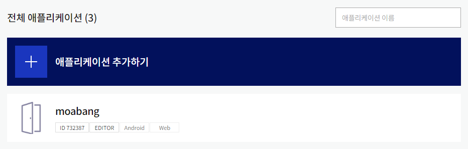
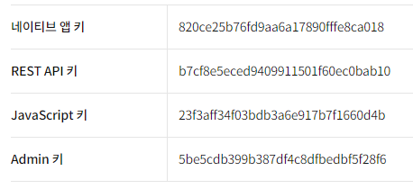
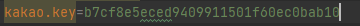

1. 카카오 디벨로퍼에서 애플리케이션 추가하기

2. SpringBoot의 application.properties에 kakao.key 부분을 REST API 키로 바꿔준다.

   

3. Android 소셜 로그인을 위해 xxx부분을 네이티브 앱 키로 바꿔준다.

4. React 소셜 로그인을 위해 xxx부분을 JavaScript키로 바꿔준다.

   

5. React의 xxx 부분에 kakao map을 활용하기 위해서 바꿔준다.

   

6. Android의 xxx 부분에 Google map을 활용하기 위해서 바꿔준다.

   

   
